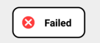

# Android-CustomToast

**Watch this video**

[</img>](https://youtu.be/dDTjoCSvfs8)

[**Android-CustomToast**](https://github.com/shivam301296/Android-CustomToast) :zap: is a powerful & easy to use Custom Toast library for Android. It runs on [API level 14](http://developer.android.com/guide/topics/manifest/uses-sdk-element.html#ApiLevels) and upwards. 
This library provides some predefined custom toast. Also you can coustomize the toast according to your need 

:zap:**A Single line of code can add a beautiful toast message in your app.** :zap:


| Code | Output |
| ------------- | ------------- |
| `CT.success(this, "Success");` | </img>  |
| `CT.success2(this, "Success");` | </img>  |
| `CT.failed(this, "Failed");` | </img>  |
| `CT.failed2(this, "Failed");` | </img>  |
| `CT.loading(this, "Loading...");` | </img>  |
| `CT.loading2(this, "Loading...");` | </img>  |
| `CT.mute(this, "Silent mode");` | </img>  |
| `CT.mute2(this, "Silent mode");` | </img>  |
| `CT.normal(this, "Normal Toast");`| </img>  |
| `CT.normal2(this, "Normal Toast");`| </img>  |
| Custom Toast| </img>  
| Custom Toast2 | </img>  |

Setup
-----

**Gradle dependency (recommended)** 

  -  Add the following to your project level `build.gradle`:
 
```gradle
allprojects {
	repositories {
		maven { url "https://jitpack.io" }
	}
}
```
  -  Add this to your app `build.gradle`:
 
```gradle
dependencies {
	compile 'com.github.shivam301296:Android-CustomToast:1.0.1'
}
```

**Or use Maven**
- Add the following to the `<repositories>` section of your `pom.xml`:

 ```xml
<repository>
        <id>jitpack.io</id>
        <url>https://jitpack.io</url>
</repository>
```
- Add the following to the `<dependencies>` section of your `pom.xml`:

 ```xml
<dependency>
        <groupId>com.github.shivam301296</groupId>
	      <artifactId>Android-CustomToast</artifactId>
	      <version>1.0.0</version>
</dependency>
```

## Documentation

For a **detailed documentation** :notebook_with_decorative_cover:, please have a look at the [**Wiki**](https://github.com/shivam301296/Android-CustomToast/wiki) 


**For using predefined Toast**

Refer to the above table (Code and Output)


**For using Custom Toast**

    new CT.Builder(this, "Your message")
                .textCol(Color.BLACK)
                .backCol(Color.YELLOW)
                .borderCol(Color.BLACK)
                .borderWidth(20)
                .image(R.drawable.apple)
                .gravity(Gravity.CENTER)
                .radius(80,0,0,80)
                .show();

| Method  | Use |
| ------------- | ------------- |
| `textCol(int color)` | Set text color|
| `backCol(int color` | Set background color |
| `borderCol(int color)` | Set border color |
| `borderWidth(int width` | Set border width |
| `image(int imageResource)` | Set image in the toast |
| `gravity(int gravityConstant)` | Set Toast gravity (Location) |
| `radius(int topLeft, int topRight, int bottomLeft, int bottomRight),` | Set toast layout corner radius |
| `shape(int shape)` | Set toast shape |
| `duration(int duration)` | Set toast duration |
| `show()` | **Don't forget to call this method** |

#### Works on
* Android 4.0.1 (Ice Cream Sandwich) and above.

### Permissions
* Does not require any special permission

### Built With

* [Android Studio](https://developer.android.com/studio/index.html) - The Official IDE for Android

### Third party libraries
* No external library dependency

### Authors

* **Shivam Agrawal** - [Rising Hope](http://risinghopeapps.weebly.com/)
* Special Thanks to **[Levi Bostian](https://github.com/levibostian)** who tought me to [build Andorid Library](https://www.youtube.com/watch?v=RYiZZprUNJw)

### Version 
* Version 1.0.1

## License 
* see [LICENSE](/LICENSE) file
